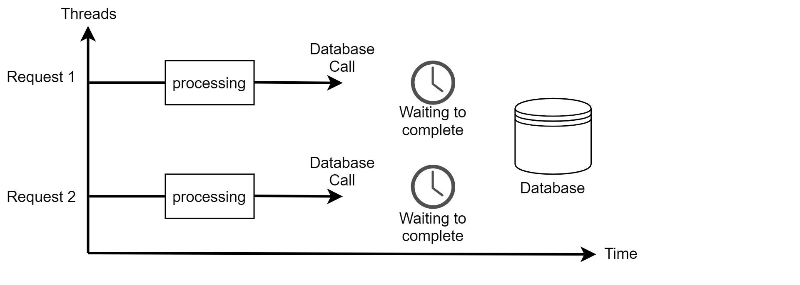
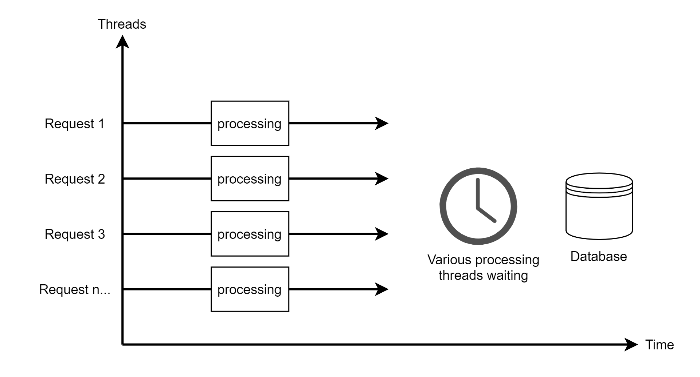
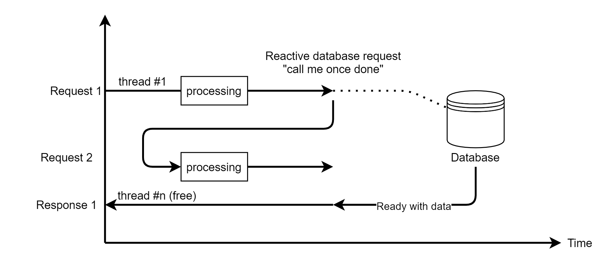
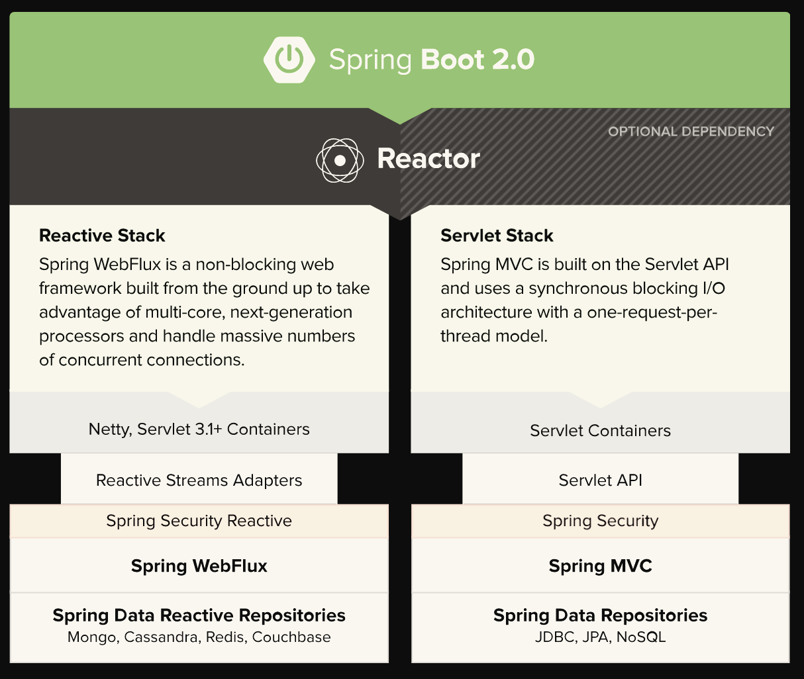
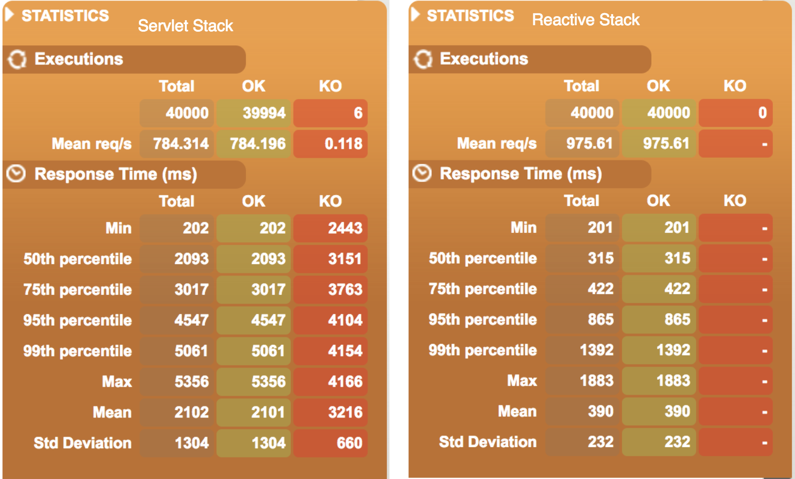

# What is Reactive Programming?

The reactive paradigm is based on the [Reactive Manifesto](https://www.reactivemanifesto.org/), it allows you to build robust systems, resilient to high load by implementing [asynchronous](https://www.reactivemanifesto.org/glossary#Asynchronous), [non-blocking](https://www.reactivemanifesto.org/glossary#Non-Blocking) operations, alleviating the system's [backpressure](https://www.reactivemanifesto.org/glossary#Back-Pressure). 

This paradigm is concerned with data streams, it's possible to express data streams in the static form (e.g. strings, arrays) or dynamic (e.g. event emiters).

As overwhelming as it may sound, all of these concepts are key to understand the reactice paradigm.

> Reactive Systems are those that are Responsive, Resilient, Elastic and Message Driven.
>
> *- The Reactive Manifesto*

## Example to illustrate reactive programming

Let's say we have a simple, traditional application that fetches certain products from a database.

For each request received, our application will create a servlet thread to process the incoming data and all our processing flow will be within this same thread.

After processing the client's request, we need to access the database to fetch the products.

This database call is an operation between our application and the database driver, during this call our application enters in a waiting state: it's blocked until the database gives the data requested back to our application.

If during this waiting period, another request comes in to our application, another thread will be created for it's processing and the same flow applies.

Here's a diagram exemplifying the described process:

Of course, every application has a limited pool of threads it can use. If you're using Tomcat as your servlet, the [default values are 25 for the minimum amount of threads and 200 is the largest the pool will be before the server starts queueing up requests](https://www.baeldung.com/java-web-thread-pool-config#tomcat).

That means that if you have 200 concurrent requests on your application, you will have each request a thread assigned to it. This brings a huge problem for concurrency, because if you have more concurrent requests than your thread pool, requests will start to hang until another processing thread is free. 

Here's a diagram which shows threads being stacked on waiting the databse for a response:

### Efficiently serve more requests

When implemeting the reactive programming model, you don't have blocked threads waiting for the database to respond. Instead, you execute your request and go on to processing other things, and only when the database has the result, you go back to processing from that point on.

Here's a diagram showing how our application would behave applying reactive programming: 

The applications must be ready to process this asynchronously, it makes it's request to the database and goes on to processing another incoming request while the databse still hasn't concluded. By a callback, the application receives the signal that the database is ready with it's data and retrieves it in a free thread. This is important to note because the database response can be retrieved by any free thread, not the same one that started the process.

As requests arrives over time, we cannot block the program, that is, any of our threads, because the consumer does not know when the next set of data will arrive.

In essence, reactive programming provides a model where we can write non blocking and async applications, which gives us
better performance.

## Performance compared

Let's take a look into articles comparing the performance of reactive stack applications! The first article we cite is [SpringBoot 2 performance — servlet stack vs WebFlux reactive stack by Raj Saxena](https://medium.com/@the.raj.saxena/springboot-2-performance-servlet-stack-vs-webflux-reactive-stack-528ad5e9dadc).

Raj's article was written shortly after the release of SpringBoot 2 with the introduction of the WebFlux framework and it has the purpose of comparing in terms of performance the reactive stack against the servlet stack offered by Spring.

*SpringBoot 2 Stacks - by Raj Saxena*

Raj's tests are quite straightforward: an application to execute a registration service was created for both stacks, with a mocked backend that introduces 200 ms of delay. Then the tool [Gatling](https://gatling.io/) was used to execute requests and measure response times. The most stressing test made by the author emphasized the improvement that the reactive stack offers over the traditional one. With 10.000 simultaneous users executing 4 requests each, the reactive stack achieved an average of 390 ms of response time, while the servlet stack achieved 2.102 ms. Thus, the reactive stack also achieved a higher value in the requests per second metric, with 975.61 requests being attended by second in the reactive stack, while the servlet stack served 784.31.

*Servlet vs Reactive performance — 10000 users (4 requests/user) - by Raj Saxena*

The second benchmark we look into is [Blocking vs Reactor Spring benchmarch made by Miloš Zubal](https://github.com/mzubal/spring-reactor-benchmark). The scenario built by the author aims to simulate what was mentioned in the example of the previous chapter - the 'traditional' application will hit the thread-pool limitation, while the reactive application should handle this just fine.

The application is very simple, it has a REST Controller which returns fake data with an artificial delay of one second. The load test created by the author starts with 10 users executing requests and continually raises to 500 users over the period of 60 seconds.

To keep this topic concise and to not end up copying the whole article content here, you can check the [tests results in the author's repository](https://github.com/mzubal/spring-reactor-benchmark#results). By those tests, it is very clear that the thread-pool limitation of tomcat ends bottlenecking the performance very hard. 

## Project Reactor

Project Reactor is a library that implements the reactive programming model based on the [Reactive Streams Specification](https://www.reactive-streams.org/), a standard for building reactive applications. 

It's one of libraries behind [Spring Webflux](https://docs.spring.io/spring/docs/current/spring-framework-reference/web-reactive.html), which is the main focus of this research! So understanding project reactor is essential for understading Spring Webflux.

## When to use: Tax Service Example

To bring this more closely to what we work with, let's take the example of Tax Service.

When the application was designed for Cloud Foundry, one of the key aspects that were prioritized was performance, and to achieve that, the entry point micro service, the one that handles the requests, needed to be highly scalable and performatic.

Hence, there was the decision to use Java with Spring Webflux stack for development of this entry point micro service, which is [Tax Maestro](https://github.wdf.sap.corp/tax-service/tax-maestro). With this, the points explained above regarding backpressure, resilience, and handling of threads can be achieved, by using the reactive programming technology. 

## Code Complexity

It's important to mention that reactive programming and its frameworks increases code complexity considerably. We can see this even by the [examples section](./initial-concepts.md#manipulating-and-managing-reactive-streams) of this documentation, where simple operations require more instructions to be executed. It also takes time to learn and understand the many operators of reactive frameworks, so consider the learning curve required to do a good implementation of a reactive project.

## References

1. [Reactive Manifesto](https://www.reactivemanifesto.org/)
2. [Reactive Streams](https://www.reactive-streams.org/)
3. [Reactive Programming](https://paulstovell.com/reactive-programming/)
4. [Definition of Reactive Programming](https://en.wikipedia.org/wiki/Reactive_programming)
5. [What is Spring Webflux and when to use it?](https://www.youtube.com/watch?v=M3jNn3HMeWg)
